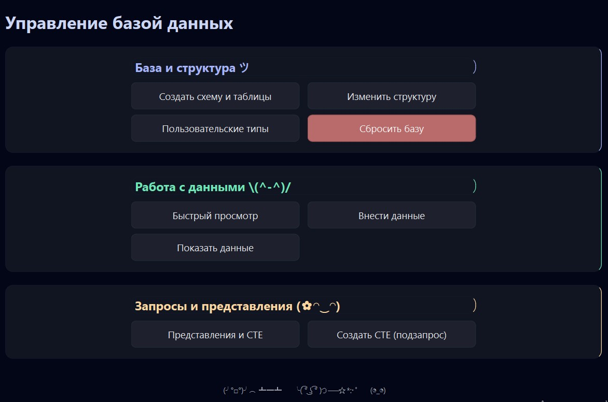
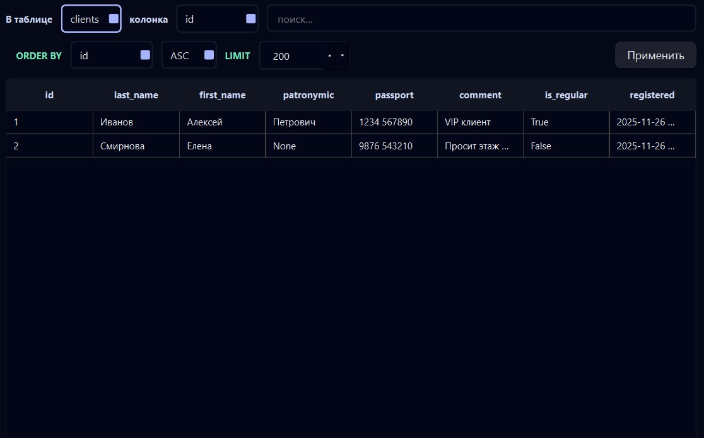
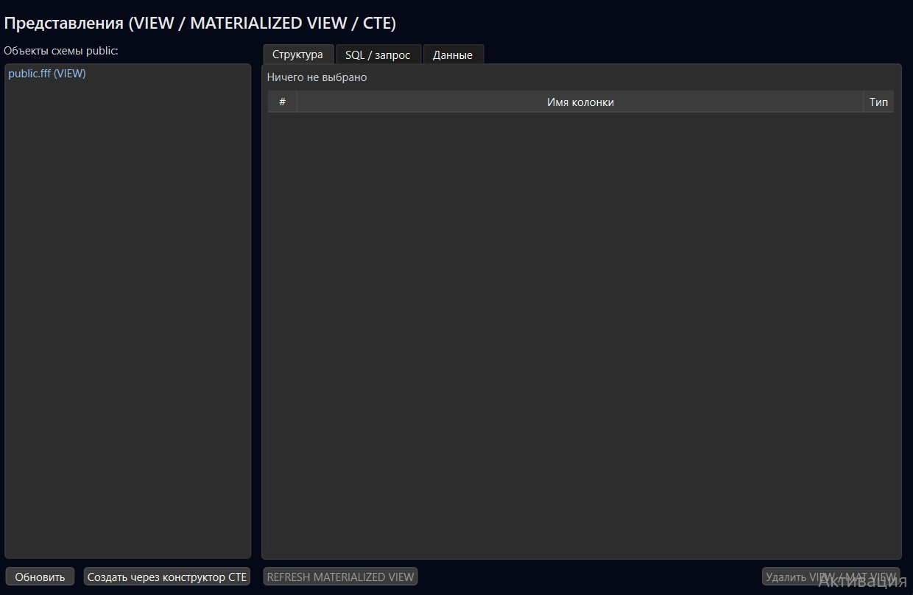

# Гостиница - настольное приложение
### (практическая работа по базам данных)
## Скриншоты





---

## Описание проекта

Приложение разработано в рамках контрольной работы по дисциплине *«Базы данных»*.  
Предметная область — **гостиница** (клиенты, номера, размещения).

Стек:

- **Python 3.12**
- **PySide6** — графический интерфейс (настольное приложение)
- **PostgreSQL** — СУБД
- **psycopg2** — подключение к БД и выполнение запросов
- **python-dotenv** — загрузка параметров подключения из `.env`

Приложение позволяет не только хранить данные о клиентах, номерах и размещениях, но и:

- работать с пользовательскими типами (ENUM и составные типы);
- просматривать и изменять структуру таблиц;
- конструировать сложные `SELECT`-запросы с `JOIN`, группировкой, `CASE`, `COALESCE`, `NULLIF`;
- сохранять запросы как `VIEW`, `MATERIALIZED VIEW` и повторно используемые CTE;
- управлять представлениями и CTE через отдельный менеджер.

---

## Установка и запуск

### 1. Клонировать репозиторий

```bash
git clone https://github.com/hsugvusrihgvir/hotel_app
cd hotel_app
```

### 2. Создать виртуальное окружение и установить зависимости

```bash
python -m venv .venv
# Windows:
.venv\Scripts\activate
# Linux / macOS:
source .venv/bin/activate

pip install -r requirements.txt
```

### 3. Настроить подключение к PostgreSQL

Создать файл `.env` в корне проекта (рядом с `main.py`) и указать параметры подключения:

```env
DB_HOST=localhost
DB_PORT=5432
DB_USER=postgres
DB_PASSWORD=postgres
DB_NAME=hotel_db
```

Класс `Database` сам подхватывает эти значения при запуске приложения и использует их для создания соединения с БД.

### 4. Подготовить схему БД

В проекте есть два SQL-скрипта:

- `db/schema.sql` — создание типов и таблиц без сброса схемы;
- `db/reset.sql` — полная пересборка схемы `public` (DROP SCHEMA + создание типов и таблиц + демо-данные).

Базовую схему можно развернуть двумя способами.

**Вариант A — из приложения**

1. Запустить приложение (`python main.py`).
2. Нажать кнопку **«Создать схему и таблицы»**.
3. При необходимости использовать **«Сбросить базу»**, чтобы выполнить `reset.sql` и получить чистую схему с тестовыми данными.

**Вариант B — вручную через psql / DBeaver**

```bash
psql -h localhost -U postgres -d hotel_db -f db/reset.sql
```

---

## Структура проекта (основные файлы)

- `main.py` — входная точка приложения: создаёт `QApplication`, подключается к БД и открывает `MainWindow`.
- `app/main_window.py` — логика главного окна, обработчики нажатий на кнопки меню.
- `app/ui/ui_main_window.py` — верстка главного окна: тёмная тема, три блока («Структура БД», «Работа с данными», «Запросы и представления») и футер.
- `app/ui/enter_data_dialog.py` — диалог для внесения/редактирования данных в таблицах.
- `app/ui/quick_view_window.py` — **Быстрый просмотр**: выбор таблицы, простые фильтры и просмотр результата.
- `app/ui/join_master_dialog.py` — мастер настраиваемого `JOIN`: выбор двух таблиц, ключей и типа соединения.
- `app/ui/data_window.py` — **Расширенный SELECT**: конструктор запросов с `JOIN`, фильтрами, группировкой, оконными и строковыми операциями, `CASE/NULL`.
- `app/ui/alter_table_window.py` — изменения структуры таблиц (`ALTER TABLE`).
- `app/ui/types_window.py` — менеджер пользовательских типов PostgreSQL (ENUM и COMPOSITE).
- `app/ui/views_window.py` — менеджер VIEW / MATERIALIZED VIEW / CTE.
- `app/ui/cte_builder_window.py` — конструктор CTE-подзапросов на основе уже реализованных виджетов WHERE/HAVING.
- `app/ui/collapsible_section.py` — универсальный виджет «складывающихся» секций для аккуратной панели инструментов.
- `app/ui/cte_storage.py` — глобальное хранилище сохранённых CTE (`GLOBAL_SAVED_CTES: Dict[str, str]`), общее для DataWindow и менеджера представлений.
- `app/ui/theme.py` — общая тёмная цветовая схема и палитра для всех окон.
- `app/log/log.py` — настройка логгера `app`, вывод в консоль и в файл `app_YYYY-MM-DD.log`.
- `app/db/db.py` — класс `Database`: подключение, транзакции и вспомогательные методы (DDL, SELECT, JOIN, CTE, представления, работа с пользовательскими типами).
- `db/schema.sql`, `db/reset.sql` — скрипты с определением типов, таблиц и тестовыми данными.

---

## Функционал приложения

### Главное окно

Главное окно разделено на три логических блока:

1. **Структура БД**
   - **«Создать схему и таблицы»** — первичная инициализация схемы и таблиц.
   - **«Изменить структуру»** — открывает окно `AlterTableWindow` для генерации `ALTER TABLE`.
   - **«Пользовательские типы»** — менеджер пользовательских типов (ENUM и COMPOSITE).
   - **«Сбросить базу»** — выполняет `reset.sql`, полностью пересоздавая схему `public` и наполняя её тестовыми данными.

2. **Работа с данными**
   - **«Быстрый просмотр»** — простое окно для выбора таблицы, задания базовых фильтров и просмотра результата в таблице.
   - **«Внести данные»** — диалог для добавления/редактирования записей в таблицах (клиенты, номера, размещения).
   - **«Показать данные»** — открывает **Расширенный SELECT** (DataWindow) для работы с `JOIN`, фильтрами и группировками.

3. **Запросы и представления**
   - **«Представления и CTE»** — менеджер VIEW / MATERIALIZED VIEW / CTE.
   - **«Создать CTE (подзапрос)»** — отдельный конструктор CTE, заточенный под сложные подзапросы.

---

### Схема базы данных

Схема описана в `schema.sql` / `reset.sql` и включает:

- Пользовательский ENUM-тип `comfort_enum ('standard', 'semi_lux', 'lux')`.
- Таблица **clients** — клиенты гостиницы (ФИО, паспорт, комментарий, признак постоянного клиента, дата регистрации).
- Таблица **rooms** — номера (номер комнаты, вместимость, комфортность, цена, массив удобств `TEXT[]` с ограничением на размер массива).
- Таблица **stays** — размещения (клиент, номер, даты заезда/выезда, оплачен ли, заметка, статус, проверка `check_out > check_in`).

Скрипт `reset.sql` также создаёт несколько тестовых клиентов, номеров и размещений, чтобы сразу увидеть данные в интерфейсе.

---

### Расширенный SELECT (окно DataWindow)

Окно `DataWindow` — это конструктор сложных `SELECT`-запросов с `JOIN`, фильтрами, агрегированием и строковыми операциями.

Основные возможности:

- Выбор столбцов для `SELECT` через список с чекбоксами.
- Построение условий `WHERE`:
  - выбор колонки и оператора (`=`, `<>`, `>`, `<`, `>=`, `<=`, `LIKE`, `ILIKE`);
  - проверка типов (например, `LIKE` запрещён для числовых/дат и булевых полей, с понятным сообщением об ошибке);
  - автоматическое экранирование строковых значений и подстановка `%...%` для строкового поиска.
- Поиск по строкам с поддержкой:
  - `LIKE`, `ILIKE`;
  - регулярных выражений (`~`, `~*`, `!~`, `!~*`);
  - `SIMILAR TO` / `NOT SIMILAR TO`.
- Подзапросы `ANY / ALL / EXISTS / NOT EXISTS`:
  - выбор «левого» поля, таблицы подзапроса и поля в подзапросе;
  - опциональный mini-`WHERE` для подзапроса.

**Агрегация и группировка:**

- Режимы `GROUP BY`, `ROLLUP`, `CUBE` и `GROUPING SETS` с выбором до трёх уровней группировки.
- Агрегаты `COUNT`, `SUM`, `AVG`, `MIN`, `MAX` с автоматическим добавлением псевдонима `agg_value`.
- Конструктор `HAVING` (на основе `HavingBuilderWidget`) — условия по агрегатам с проверкой, что сравниваем с числом.
- Динамический `ORDER BY`: в агрегатном режиме можно сортировать по группирующим полям и по `agg_value`.

**CASE и работа с NULL:**

Отдельная вкладка **«CASE / NULL»** позволяет без ручного SQL добавлять вычисляемые столбцы:

- **CASE**:
  - выбор колонки, оператора и значений (в т.ч. `BETWEEN`);
  - формирование выражения `CASE WHEN ... THEN '...' ELSE '...' END AS alias`;
  - значения автоматически экранируются, применяются правила форматирования из `WhereBuilderWidget`.
- **COALESCE**:
  - подстановка значения вместо `NULL` с учетом типа колонки;
  - авто-alias вида `<col>_coalesce`.
- **NULLIF**:
  - преобразование конкретного значения в `NULL`;
  - авто-alias вида `<col>_nullif`.

Все созданные выражения добавляются в `SELECT`, регистрируются как виртуальные колонки и становятся доступны для сортировки и строковых операций.

**Строковые операции (правая панель):**

Панель «Строковые операции» позволяет получить новые столбцы из текстовых полей:

- `UPPER`, `LOWER`, `TRIM`;
- `SUBSTRING(col FROM start FOR length)`;
- `LPAD` / `RPAD` (дополнение строк до нужной длины указанным символом);
- `CONCAT` — склейка двух столбцов с разделителем.

Результат каждой операции добавляется как новый столбец (`alias` формируется автоматически).

**Сохранение запросов:**

Сверху есть панель «Сохранить текущий SELECT как»:

- **VIEW** — создаёт/обновляет обычное представление.
- **MATERIALIZED VIEW** — создаёт материализованное представление (`CREATE MATERIALIZED VIEW`).
- **CTE** — сохраняет текущий `SELECT` как именованный CTE в глобальном словаре `GLOBAL_SAVED_CTES`.

---

### Пользовательские типы

Окно **«Пользовательские типы»** позволяет:

- просматривать существующие пользовательские типы в схеме (`ENUM` и `COMPOSITE`);
- создавать новые ENUM-типы с набором значений;
- добавлять значения в существующие ENUM;
- создавать составные типы (список полей и их типов);
- удалять типы с выбором режима `RESTRICT` / `CASCADE`.

При удалении значения ENUM проверяется версия сервера PostgreSQL: поддержка `ALTER TYPE ... DROP VALUE` есть только с версии 16, и пользователю показывается понятное сообщение, если версия ниже.

---

### Представления и CTE

Окно **«Представления и CTE»** (`ViewsWindow`) — менеджер объектов схемы `public`:

- слева: список VIEW, MATERIALIZED VIEW и сохранённых CTE;
- справа: вкладки:
  - **«Структура»** — список столбцов и типов;
  - **«SQL / запрос»** — текст внутреннего `SELECT` / определения;
  - **«Данные»** — содержимое представления/CTE.
- кнопки:
  - «Обновить» — перечитать список объектов;
  - «Создать через конструктор CTE» — открыть `CteBuilderWindow` и сохранить новый CTE в общее хранилище;
  - «REFRESH MATERIALIZED VIEW» — обновить данные материализованного представления;
  - «Удалить VIEW / MAT VIEW» — удалить выбранный объект.

---

### Логирование и отладка

Все ключевые действия пишутся в логгер `app` и сохраняются в каталог `app/log/logs` (файл вида `app_YYYY-MM-DD.log`).

Логируются:

- успешное подключение и закрытие БД;
- выполнение DDL и крупных операций;
- выполнение сложных запросов из DataWindow и других окон.

При возникновении ошибок пользователю показываются диалоговые окна `QMessageBox`, а подробности можно посмотреть в лог-файле.

---

## Пример сценария работы

1. Запустить приложение и убедиться, что соединение с БД установлено.
2. Нажать **«Сбросить базу»**, чтобы развернуть демо-схему и тестовые данные.
3. Через **«Быстрый просмотр»** открыть таблицу `clients` и посмотреть список клиентов.
4. Открыть **«Показать данные»**, выбрать `clients INNER JOIN stays` и построить отчёт по проживанию клиентов:
   - добавить фильтр по дате заезда;
   - сгруппировать по клиенту и посчитать количество проживаний;
   - добавить `CASE`-столбец с категорией клиента (например, «VIP», «Новый»).
5. Сохранить построенный запрос как `VIEW` и посмотреть его структуру/данные через **«Представления и CTE»**.

---

## 👩‍💻 Авторы

- Гончарова Маргарита, ЭФБО-03-24  
- Емельянова Дарья, ЭФБО-03-24  
- Доськова Мария, ЭФБО-03-24  
- Жулева Дарья, ЭФБО-03-24  
